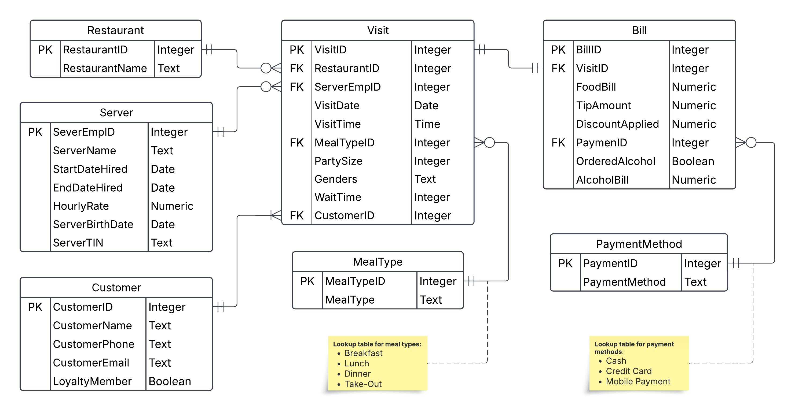

# Visitor Analytics & Management System

This project was developed as part of **CS5200 – Practicum I** at Northeastern University.  
It demonstrates the **end-to-end pipeline** of designing, implementing, and analyzing a normalized relational database from a raw CSV dataset of restaurant visits.

---

## Key Features
- **Database Normalization:** Designed a relational schema normalized to the Third Normal Form (3NF) to ensure data integrity and reduce redundancy.
- **ETL Pipeline:** Developed a series of R scripts to create the database schema, extract data from a source CSV, clean and transform the data (handling missing values and inconsistencies), and load it into a cloud-hosted MySQL database.
- **Data Validation:** Implemented a testing script to verify data integrity by comparing record counts and financial totals between the source CSV and the populated database.
- **SQL Analytics & Reporting:** Created a dynamic PDF report using R Markdown and SQL to analyze sales revenue by restaurant and track trends over time.
- **Business Logic:** Implemented MySQL stored procedures to encapsulate common business operations, such as adding new visit records.

---

## Database Schema (ERD)

The database is designed to separate concerns into distinct entities like Customers, Servers, Visits, and Bills, linked by primary and foreign keys.



---

## Repository Structure
```
restaurant-visits-db/
│── designDBSchema.PractI.SuraS.Rmd      # Database design + normalization
│── createDB.PractI.SuraS.R              # Script to create schema in MySQL
│── deleteDB.PractI.SuraS.R              # Script to drop tables
│── loadDB.PractI.SuraS.R                # Load CSV data into DB
│── testDBLoading.PractI.SuraS.R         # Validate data load
│── revenueReport.PractI.SuraS.Rmd       # Analytics report (restaurant, year trends)
│── configBusinessLogic.PractI.SuraS.R   # Stored procedures for visit insertion
│── /data
│    └── restaurant-visits-139874.csv    # Raw CSV data dump
│── /docs
│    └── ERD.png                         # Entity-Relationship Diagram
│── /res
│    ├── revenueReport.PractI.SuraS.pdf  # Generated revenue report
│    └── designDBSchema.PractI.SuraS.pdf # Generated schema design doc
│── README.md
```

---

## How to Run

### Prerequisites

-   R and RStudio installed.
-   Access to a cloud-hosted MySQL database (e.g., Aiven, AWS RDS).
-   Update the database connection credentials in all `.R` and `.Rmd` files.

### Execution Order

Run the scripts in the following sequence from within RStudio:

1. Clone repo:
   ```bash
   git clone https://github.com/karthikeyansura/restaurant-visits-db
   ```
1. **`createDB.PractI.SuraS.R`**: Establishes the database schema.
2. **`configBusinessLogic.PractI.SuraS.R`**: Sets up stored procedures for visit insertion.
3. **`loadDB.PractI.SuraS.R`**: Populates the database.
4. **`testDBLoading.PractI.SuraS.R`**: Verifies the integrity of the loaded data.
5. **Knit `revenueReport.PractI.SuraS.Rmd`**: Generates the final PDF analysis report.
6. (Optional) Run **`deleteDB.PractI.SuraS.R`** to clear the database.
